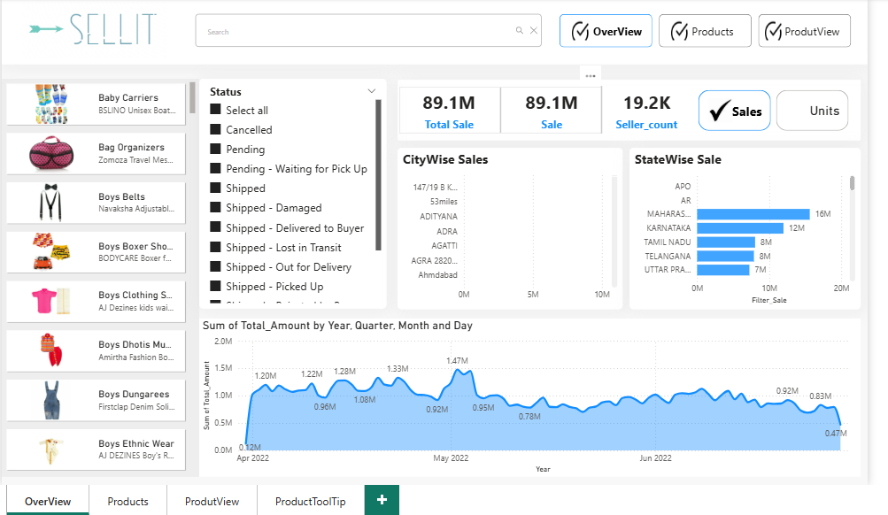
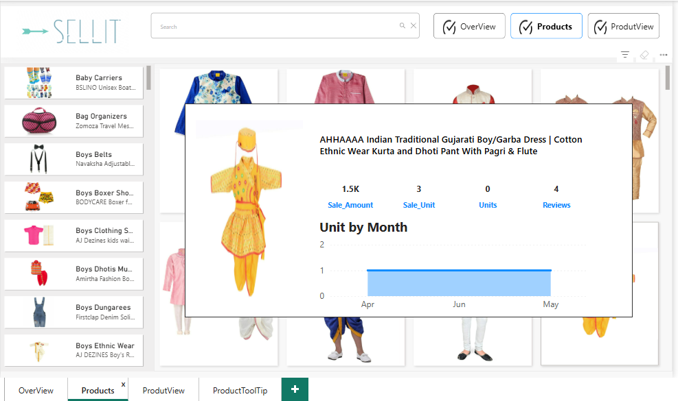
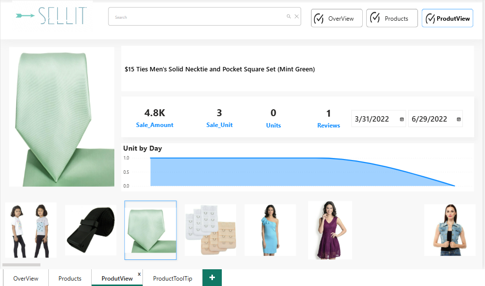
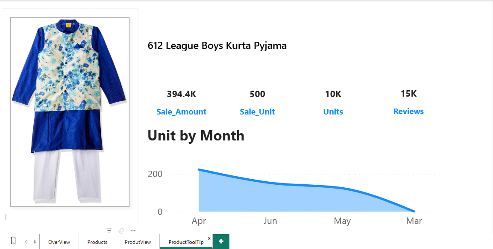

# 🛍️ Power BI E-Commerce Dashboard – SellIt (Clothing Store Sales Analysis)

## 📌 Overview

This project presents a **Power BI dashboard** designed to visualize and analyze the **sales performance of an e-commerce clothing store**. The dashboard transforms raw sales data into meaningful insights to help stakeholders make data-driven decisions and track key business metrics effectively.

## 📊 Features

- **Sales Overview:**  
  Track total sale, number of orders, and average order value over time.

- **Product Performance:**  
  Identify best-selling products, categories (e.g., shirts, jeans, jackets), and analyze product-wise sale contribution.

- **Customer Insights:**  
  Explore customer demographics, have overview, products and product view pages to analyse detailes.

- **Time-Based Analysis:**  
  Monthly,quarterly and day performance trends to identify seasonality and peak sales periods.

### 📈 Key Metrics (KPIs)
- Total Sales  
- Sale
- Seller Count
- Sale units
- Units
- Reviews
- Tooltip show unit by month

## 🧾 Data Source

- taken help from following video: https://www.youtube.com/watch?v=zjP-FhG6PAU&ab_channel=TheDeveloper

## 🛠️ Tools & Technologies

- **Power BI Desktop**  
- **DAX (Data Analysis Expressions)**  
- **Power Query** for data transformation  
- **Data Modeling**: Star schema with fact and dimension tables

## 📁 File Contents

- `sellit.pbix`: Power BI dashboard file  
- `README.md`: Project documentation (this file)
-  Dashboard screenshots for visual reference:
  - `overview.png` – Overview page of the dashboard  
  - `products.png` – Products performance analysis  
  - `productview.png` – Product-level detail view  
  - `tooltip.png` – Monthly unit tooltip visual

## 🖼️ Dashboard Preview

### Overview Page

### Products Page

### Product View Page

### Tooltip

## 🚀 Getting Started

1. Open the `sellit.pbix` file using **Power BI Desktop**.  
2. Explore the interactive visuals and use filters/slicers for deeper insights.  

